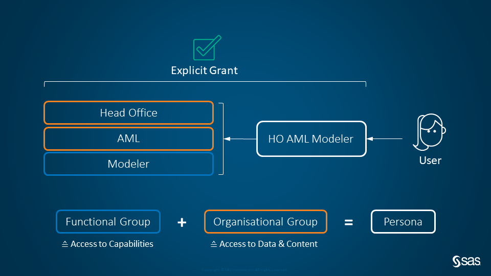
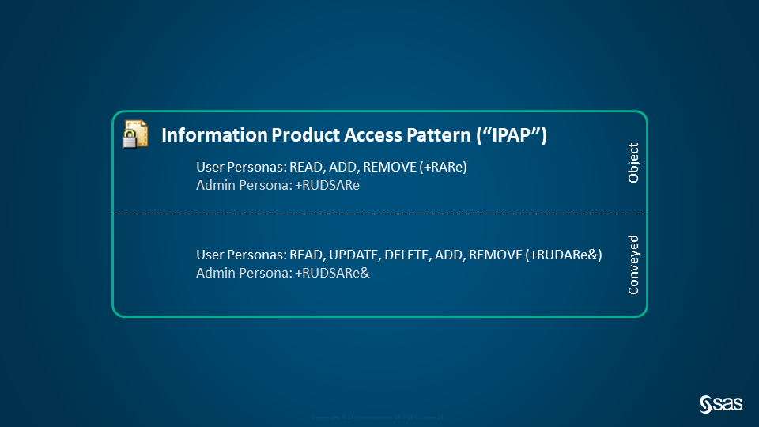
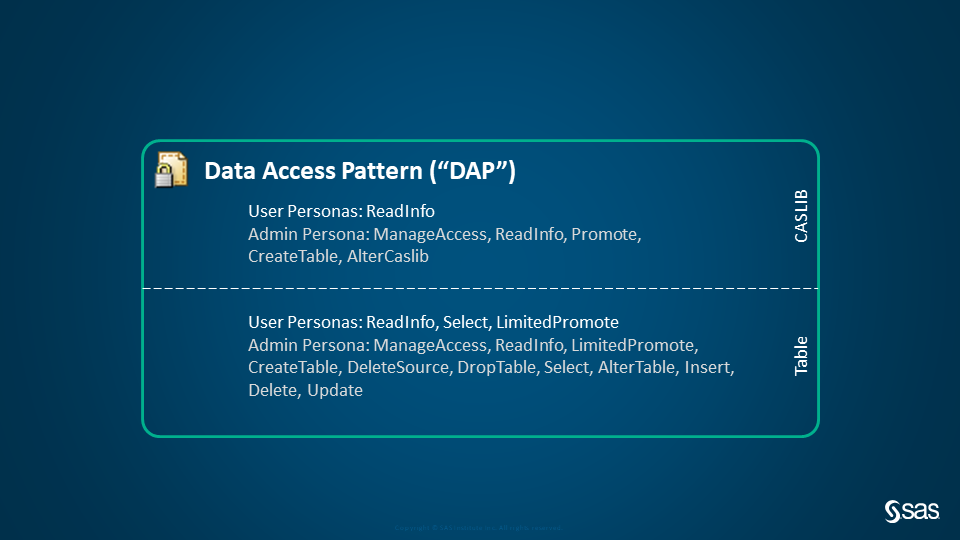

# SAS Viya Authorization Model

## Intent
Defining, applying, and documenting repeatable, standardized authorization patterns for SAS Viya.
## Prerequisites
This tool has been developed subject to the following prerequisites:
- SAS Viya 2020.1 or later
- Either:
  - [sas-viya CLI](https://support.sas.com/downloads/package.htm?pid=2512) installed and one or more profiles initialized (i.e. `sas-viya profile init`), OR
  - Environment Variables `GVA_USER`, `GVA_PW`, and `GVA_BASEURL` set
- (Service) account with permissions to create and modify SAS Viya & CAS objects (folders, files, global scope CASLIBs, etc.) and configure corresponding authorization (i.e. a member of the `SASAdministrators` superuser group)

_Note: All functionality can be run from a host that is not part of the SAS Viya environment but has HTTP(S) network connectivity to it. If using HTTPS, the TLS certificate chain (including the Root CA) need to be valid for the client._
## Configuration
### Precedence order
Configuration properties are evaluated in the following order of precedence:
- CLI Flags
- Environment Variables
- Configuration File
- Defaults
### CLI Flags
To explore the available commands and flags, call the `goviyaauth help` command.
### Environment Variables
The following environment variables are available for configuration:

|Variable|Default|Description|
|---|---|--|
|`GVA_CLIDIR`|`/opt/sas/viya/home/bin/`|Path to the SAS Viya admin-cli directory|
|`GVA_CASSERVER`|`cas-shared-default`|CAS server to apply DAP|
|`GVA_LOGFILE`|`gva-YYYY-MM-DD.log`|Path to and name of log file|
|`GVA_LOGLEVEL`|`INFO`|[Logging level](https://godoc.org/go.uber.org/zap/zapcore#Level)|
|`GVA_RESPONSELIMIT`|`1000`|[Limit](https://developer.sas.com/apis/rest/#pagination) of REST items returned|
|`GVA_BASEURL`|n/a|SAS environment base URL (e.g. `sas-endpoint` in `~/.sas/config.json`)|
|`GVA_VALIDTLS`|`true`|Validate the TLS connection is secure|
|`GVA_PROFILE`|`Default`|Profile to use from `~/.sas/config.json`|
|`GVA_USER`|n/a|SAS Administrator account username|
|`GVA_PW`|n/a|SAS Administrator account password|
|`GVA_CLIENTID`|`sas.cli`|OAuth 2.0 Client ID registered with SAS Logon Manager|
|`GVA_CLIENTSECRET`|n/a|OAuth 2.0 Client Secret registered with SAS Logon Manager|
### Configuration File
A configuration file can be placed at `$HOME/.sas/gva.json` to define the following properties:

|Variable|Default|Description|
|---|---|--|
|`clidir`|`/opt/sas/viya/home/bin/`|Path to the SAS Viya admin-cli directory|
|`casserver`|`cas-shared-default`|CAS server to apply DAP|
|`logfile`|`gva-YYYY-MM-DD.log`|Path to and name of log file|
|`loglevel`|`INFO`|[Logging level](https://godoc.org/go.uber.org/zap/zapcore#Level)|
|`responselimit`|`1000`|[Limit](https://developer.sas.com/apis/rest/#pagination) of REST items returned|
|`baseurl`|n/a|SAS environment base URL (e.g. `sas-endpoint` in `~/.sas/config.json`)|
|`validtls`|`true`|Validate the TLS connection is secure|
## Authorization Patterns
Permissions are granted to SAS Viya custom groups of which Identity Provider (either LDAP or SCIM) groups and/or users are nested members. This approach retains the authorization model in case of intermittent issues with synchronization. The following figure depicts the nested relationship between example groups which maximises inheritance of authorization permissions in accordance with general security principles:

Permission assignments to authorization groups include:
- Platform Capabilities (Viya authorization rules & CAS role),
- Information Products (Viya authorization rules),
- Data Access (CAS access controls).

The defined authorization patterns form the main handover between designing and deploying a SAS Viya Authorization Model. Refer to the [samples](sample/) for guidance on the required pattern format to apply these.
### Information Products
The following figure depicts an example Information Product Access Pattern ("IPAP") to secure Information Products:

Object-level permissions apply to content folders, while conveyed permissions apply to nested objects (e.g. reports, code, etc.) within content folders. While it is possible to apply individual authorization rules to nested objects, it is good practice to inherit permissions from content folders instead.

The following table describes the SAS Viya authorization permissions used throughout the IPAP pattern definitions. The first column corresponds to the acceptable `permissions` values [defined for authorization rules](https://developer.sas.com/apis/rest/CoreServices/#schemaauthorizationrule).

|Permission|Description|
|---|---|
|read|Read an object|
|update|Update or edit an object|
|delete|Delete an object|
|create|Create a new object|
|secure|Set permissions on an object(manipulate the object’s direct rules)|
|add|Put an object into a container|
|remove|Move an object out of a container|
### Data Access
The following figure depicts an example Data Access Pattern ("DAP") to secure data:

CASLIB-level permissions apply to the overall CASLIB, while table-level permissions apply to nested tables within CASLIBs. While it is possible to apply individual authorization rules to nested tables, columns, rows, actions, and action sets, it is good practice to inherit permissions from CASLIBs instead.

The following table describes the SAS CAS access controls used throughout the DAP pattern definitions.

|Permission|Description|
|---|---|
|ReadInfo|View and traverse objects|
|Select|Read data values|
|LimitedPromote|Promote from source in the same CASLIB|
|Promote|Promote from any CASLIB|
|CreateTable|Save (persist) a table|
|DropTable|Remove a table from global scope|
|DeleteSource|Delete a physical source table|
|Insert|Add rows|
|Update|Change data values|
|Delete|Delete rows|
|AlterTable|Change the attributes or structure of a table|
|AlterCASLIB|Change the properties of a CASLIB|
|ManageAccess|Set access controls|
## Contributing
We welcome your contributions! Please read [CONTRIBUTING.md](CONTRIBUTING.md) for details on how to submit contributions to this project.
## License
This project is licensed under the [Apache 2.0 License](LICENSE).